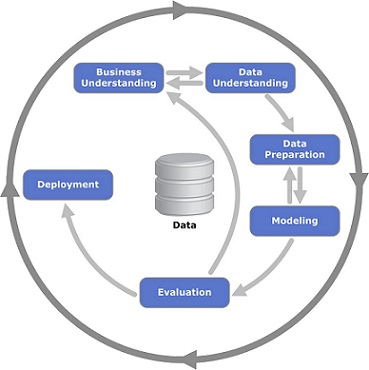

## CRISP-DM machine learning process



### CRISP-DM is an iterative process with 6 steps
1. Business Understanding(try to understand the problem)
2. Data Understanding
3. Data preparation(often called as Feature Engineering)
4. Modeling(tran the model)
5. Evaluation
6. Deployment(using the model)

#### Business understanding
- Identify the business problem
- Detect available data sources
- Specify requrements,premises, and conditions
- Clarify risks and uncertainties
- Understand whether the problem is important
- understand how we can solve it
- understand how we measure the success of our project(cost-benefit-analysis)
- do we actually need ML here?

#### Data Understanding
- Analyze available data sources
- Collect and analyse data
- Analyze if something is missing and what is missing
- Decide if this data is good/ reliable/ large enough
- Decide if we need to get more data

#### Data Preparation(=Feature Engineering)
- Transform the data so it can be put into a ML algorithm
- Usually this means extracting different features
- Clean the data / remove all the noise
- Build the pipelines( that transform raw data into clean data)
- convert data into tabular form(needed to put in machine learning model)

Feature Engineering is a key element of every ML project."Coming up with features is difficult, time-consuming, requires expert knowledge. 'applied machine learning' is basically feature engineering"

#### Modeling
- train the model(the actual ML happens here)
- try different models
- Select model parameters
- try to improve model quality
- select the best one
- sometimes, we may go back to data preparation
    - add new features
    - fix data issues
- general aspect that i've learned from practice: model quality significantly depends on data quality -> keep in mind: GGarbage in , Garbage out

#### Evaluation
- Measure how well the model solves the business problem
- Is the model good enough?
    - Have we reached the goal?
- DO our metrics improve?
- Goal:reduce the amout of spam by 50%
    - Have we reduced it? by how much?
    - (Evaluate on the test group)
- Do a retrospective:
    - was the goal achievable?
    - Did we solve/measure the right thing?
- After that , we may decide to :
    - Go back and adjust the goal
    - Roll out the model to more users/all users
    - Stop working on the project

#### Evaluation + Deployment
- Online Evaluation : evaluation of live users
    - it means: deploy the model, evaluate it

#### Deployment (=engineering practices)
- After online evaluation of some users -> deploy the model to production (all remaining users)
- Roll out the model to all users
- proper monitoring
- ensuring the quality and maintainability
- -> when we deploy model it has to work, it has to be reliable
- after that we care about scalability and other things
- like in project management this includes creating the final report 


#### Iterate!
- ML projects require many iterations!
- After deployment we come back to business understanding to check howcan we improve the model or decide that it needs to be improved or not

#### General note
- Start simple (e.g. with a simple model)
- Learn from feedback
- Improve (e.g. come back to business understanding and make this model a bit more complex)

#### the 6 steps
1. Split datasets(60%-20%-20%)
2. train the model
3. apply the model to validation dataset Repeat 2 and 3 a few times
4. select the best model
5. Apply the model to the test dataset
6. check everything is good(compare accuracy of validation and test datasets)

#### alternative approach
1. Split the original dataset into training, validation, and test sets with a ratio of 60%-20%-20%.
2. Train the initial models using the training dataset.
3. Apply the initial models to the validation dataset and evaluate their performance.
4. Select the best-performing model based on the validation results.
5. Combine the training and validation datasets to create a new combined dataset.
6. Retrain the selected model using the new combined dataset.
7. Apply the newly trained model to the test dataset to assess its performance on unseen data.

### Linear algebra

#### simple vector operations

```python
import numpy as np
u = np.array([2,4,6,8])
print(2*u)
```

```python
import numpy as np
 
u = np.array([2, 4, 5, 6])
v = np.array([1, 0, 0, 2])
print(u + v)
```

```python

import numpy as np
 
def vector_vector_multiplication(u, v):
    assert u.shape[0] == v.shape[0]
     
    n = u.shape[0]
     
    result = 0.0
     
    for i in range(n):
        result = result + u[i] * v[i]
     
    return result
 
u = np.array([2, 4, 5, 6])
v = np.array([1, 0, 0, 2])
vector_vector_multiplication(u, v)
# Output: 14.0
 
# dot product is already implemented in numpy
u.dot(v)
# Output: 14.0```
```


