# Fundamentals of Data Engineering
this notes has been created based on [Fundamentals of Data Engineering](https://learning.oreilly.com/library/view/fundamentals-of-data/9781098108298/), thanks the author [Joe Reis](https://www.linkedin.com/in/josephreis/) and [Matt Housley](https://www.linkedin.com/in/housleymatthew/)

# Data Engineering Described

1. fistly, data engineering is SQL-focused. The work and primary storage of the data is in relational databases.
2. secondly, data engineering is Big Data-focused. The work and primary storage like Hadoop, Cassandra, and HBase. All of the data processing is done in Big Data framework like MapReduce, Spark, And Flink.

Data engineering is the development, implementation, and maintenance of systems and processes that take in raw data and produce high-quality, consistent information that supports downstream use cases, such as analysis and machine learning. Data engineering is the intersection of security, data management, DataOps, data architecture, orchestration, and software engineering. A data engineer manages the data engineering lifecycle, beginning with getting data from source systems and ending with serving data for use cases, such as analysis or machine learning.

1. generation
2. storage
3. ingestion
4. transformation
5. serving

undercurrents of the data engineering
1. security
2. data management
3. dataOps
4. data architecture
5. Orchestration
6. Software Engineer

languages:
1. SQL
2. Python
3. Java
4. bash

may need to proficiency:
1. R
2. Javascript
3. C++

# Chapter 2. the data engineering lifecycle

## generation: source systems
a source system is the origin of the data used in the data engineering lifecycle. for example, a source system could be an IoT device, an message queue, or a transactional database. frequency and velocity of the data

### source systems

1. What are the essential characteristics of the data source? Is it an application? A swarm of IoT devices?
2. How is data persisted in the source system? Is data persisted long term, or is it temporary and quickly deleted
3. At what rate is data generated? How many events per second? How many gigabytes per hour
4. What level of consistency can data engineers expect from the output data? If you’re running data-quality checks against the output data, how often do data inconsistencies occur—nulls where they aren’t expected, lousy formatting, etc
5. how often do errors occurs
6. will the data contain duplocates?
7. will some data values arrive late, possibly much later than other messages produced simultaneously?
8. what is the schema of the ingested data ? will data engineers need to join across several tables or even several systems to gete a complete pictire of data?
9. if schema changes ( a new column is added), how is this dealt with and communicated to downstream stakeholders
10. how frequently should data be pulled from the source system
11. For stateful systems (e.g., a database tracking customer account information), is data provided as periodic snapshots or update events from change data capture (CDC)? What’s the logic for how changes are performed, and how are these tracked in the source database?
12. Who/what is the data provider that will transmit the data for downstream consumption?
13. Will reading from a data source impact its performance?
14. Does the source system have upstream data dependencies? What are the characteristics of these upstream systems?
15. Are data-quality checks in place to check for late or missing data?

### storage

1. Is this storage solution compatible with the architecture’s required write and read speeds?
2. Will storage create a bottleneck for downstream processes?
3. Do you understand how this storage technology works? Are you utilizing the storage system optimally or committing unnatural acts? For instance, are you applying a high rate of random access updates in an object storage system? (This is an antipattern with significant performance overhead.)
4. Will this storage system handle anticipated future scale? You should consider all capacity limits on the storage system: total available storage, read operation rate, write volume, etc
5. Will downstream users and processes be able to retrieve data in the required service-level agreement (SLA)?
6. Are you capturing metadata about schema evolution, data flows, data lineage, and so forth? Metadata has a significant impact on the utility of data. Metadata represents an investment in the future, dramatically enhancing discoverability and institutional knowledge to streamline future projects and architecture changes.
7. Is this a pure storage solution (object storage), or does it support complex query patterns (i.e., a cloud data warehouse)?
8. Is the storage system schema-agnostic (object storage)? Flexible schema (Cassandra)? Enforced schema (a cloud data warehouse)?
9. How are you tracking master data, golden records data quality, and data lineage for data governance? (We have more to say on these in “Data Management”.)
10. How are you handling regulatory compliance and data sovereignty? for example, can you store your data in certain geographical locations but not others.

understanding data access frequency
data that is most frequently accessed is called hot data.
Lukewarm data might be accessed every so often-say, every week or month
cold data is seldom queried and is appropriate for storing in an archival system.

### ingestion

the next stage of the data engineering lifecycle is data ingestion from source systems

source systems and ingestion represent the most significant bottlenecks of the data engineering lifecycle. 
1. what are the use cases for the data i am ingesting? can I reuse this data rather than create multiple versions of the same dataset?
2. are the systems generating and ingesting this data reliably, and is the data available when i need it ?
3. what is the data destination after ingestion?
4. how frequntly will I need to access the data ?
5. in what volume will the data typically arrive?
6. what format is the data in ? can my downstream storage and transformation systems handle this format?
7. is the source data in good shape for immediate downstream use? if so, for how long, and what may cause it to be unusable?
8. if the data is from a streaming source, does it need to be transformed before reaching its destination ? would an in-flight transformation be appropriate, where the data is transformed within the stream itself?

batch versus streaming 

batch ingestion is simple a specialized and convenient way of processing this stream in large chunks- for example, handling a full day's worth of data in a single batch.

streaming ingestion allows us to provide data to downstream systems - whether other applications, databases, or analytics systems- in a continuous, real-time fashion.

because of limitation of legacy systems, batch was for a long time the default way to ingest data. batch processing remains an extremely popular way to ingest data for downstream consumption, particularly in analytics and ML.

however, the separation of storage and compute in many systems and the ubiquity of event-streaming and processing platforms make the continuous processing of data streams much more accessible and increasingly popular.the choice largely depends on the use case and expectations for data timeliness.

### batch vs steam ingestion

1. if I ingest the data in real time, can downstream storage systems handle the rate of data flow?
2. do I need millisecond real-time data ingestion? or would a micro-batch approach work, accumulating and ingesting data, say, every minute?
3. what are my use case for streaming ingestion ? what specific benefits do i realize by implementing streaming? if I get data in real time, what actions can I take on that data that would be an improvement upon batch?
4. will my streaming-first approach cost more in terms of time, money, maintenance, downtime, and opportunity cost than simply doing batch?
5. are my streaming pipeline and ystem reliable and redundant if infrastructure fails?
6. What tools are most appropriate for the use case? Should I use a managed service (Amazon Kinesis, Google Cloud Pub/Sub, Google Cloud Dataflow) or stand up my own instances of Kafka, Flink, Spark, Pulsar, etc.? If I do the latter, who will manage it? What are the costs and trade-offs?
7. if I am deploying an ML model, what benefits do I have with online predictions and possibly contiuous traning?
8. Am I getting data from a live production instance ? if so, what's impact of my ingestion process on this source system?

steaming-firsty might seem like a good idea, but it's not always straightforward

### push vs pull

in the push modelof data ingestion, a source system writes data out to a target whether a database, object store, or filesystem. In the pull model, data is retrieved from the source system.

### tranformation

data needs to be changed from its original form into something useful for downstream use cases. without proper transformations, data will sit inert, and not be in a usefyl form for reports, analysis, or ML. Typically, the transformations stage is where data begins to create value for downstream user consumption

1. what's the cost and return on investment(ROI) of the transformation? what is the associated business value?
2. is the transformation as simple and self-isolated as possible?
3. what business rules do the transformations support?

### Serving Data

1. analytics
it is core of most data endeavors. Once your data is stored and transformed, you are ready to generate reports or dashboards and do ad hoc analysis on the data.
    - Business intelligence
    - Operational analytics
    - Embedded analytics

2. Machine Learning
    - Is the data of sufficient quality to perform reliable feature engineering? Quality requirements and assessments are developed in close collaboration with teams consuming the data.
    - Is the data discoverable? Can data scientists and ML engineers easily find valuable data?
    - Where are the technical and organizational boundaries between data engineering and ML engineering? This organizational question has significant architectural implications.
    - Does the dataset properly represent ground truth? Is it unfairly biased?

3. Reverse ELT

### Undercurrent across data engineering lifecycle

1. Security

data engineer must  understand both data and access security, exercising the principle of least privilege. it means giving a user or system access to only the essential data and resources to perform an intended function.

People and organizational structure are always the biggest security vulnerabilities in any company. When we hear about major security breaches in the media, it often turns out that someone in the company ignored basic precautions, fell victim to a phishing attack, or otherwise acted irresponsibly. The first line of defense for data security is to create a culture of security that permeates the organization. All individuals who have access to data must understand their responsibility in protecting the company’s sensitive data and its customers.

Data security is also about timing—providing data access to exactly the people and systems that need to access it and only for the duration necessary to perform their work. Data should be protected from unwanted visibility, both in flight and at rest, by using encryption, tokenization, data masking, obfuscation, and simple, robust access controls.

2. Data management

Data management is the development, execution, and supervision of plans, policies, programs, and practices that deliver, control, protect, and enhance the value of data and information assets throughout their lifecycle.

 - Data governance:a business analyst gets a reques for a report but doesn't know what data to use to answer the question.core: discoverability, security, and accountability
  

 - Metadata:business metadata, technical metadata, operational metadata, reference metadata

 - Data accountability:

 - Data quality: accuracy , completeness, timelines

 - Data modeling and design:

 - Data lineage:

 - data integration and interoperability:

 - data lifecycle management:

 - Ethics and privacy: mask personally identifiable information(PII) and other sensitive information, data regulations, such as GDPR, CCPA

3. DataOps

DataOps maps the best practices of Agile methodology, DevOps, and statistical process control to data. Whereas DevOps aims to improve the release and quality of software products, DataOps does the same thing for data products.

- Rapid innovation and experimentation delivering new insights to customers with increasing velocity
- Extremely high data quality and very low error rates
- Collaboration across complex arrays of people, technology, and environments
- Clear measurement, monitoring, and transparency of results

 - Automation
 - Observability and monitoring
 - Incident response
Lean practices (such as lead time reduction and minimizing defects) and the resulting improvements to quality and productivity are things we are glad to see gaining momentum both in software and data operations.

4. Data architecture

5. Orchestration

orchestration systems also build job history capabilities, visulization and alerting, Airflow

6. Software Engineering

- cire data processing code
- development of open source frameworks
- streaming
- Infrastructure as code
- Pipelines as code
- General-purpose problem solving

# Chapter 3. designing good data architecture

## principles of good data architecture

### choose common conponents wisely

### plan for failure

### architecture for scalability

### architecture is leadership

### always be architecting

### build loosely coupled systems

systems are broken into many small components, these systems interface with other services through abstraction layers, such as a messageing bus or an API

### make reversible decisions

### prioritize seurity

### embrace finops

# chapter 4. Choosing technologies across the data engineering lifecycle

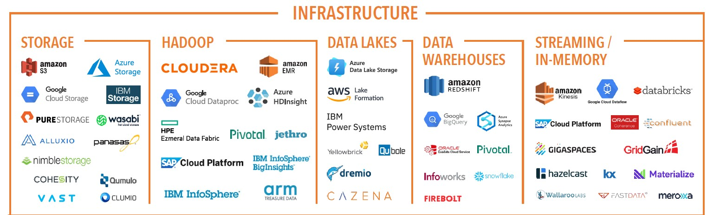

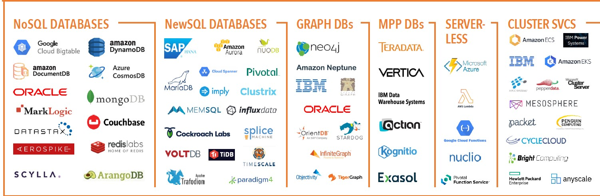

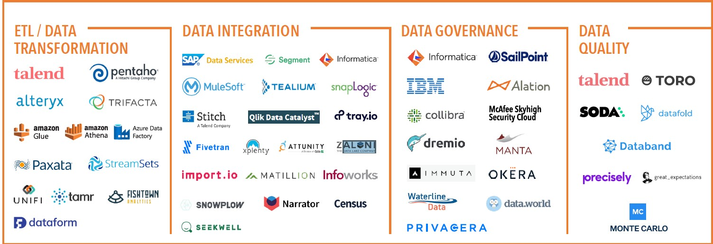

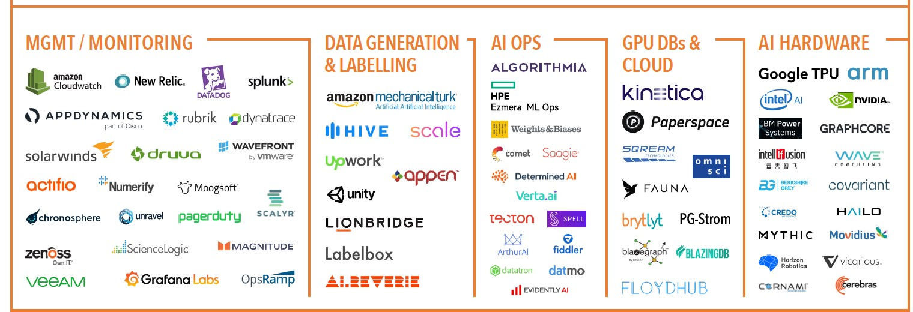

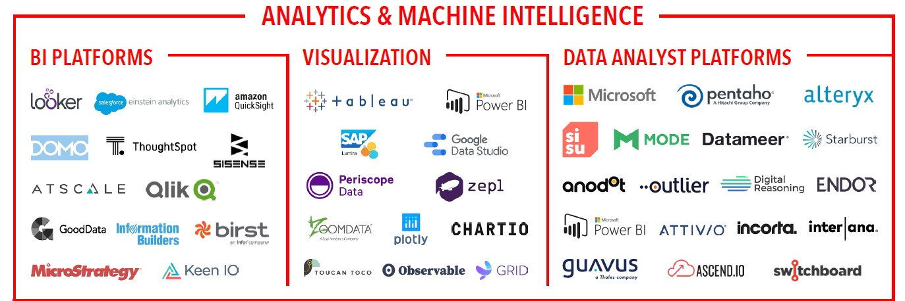

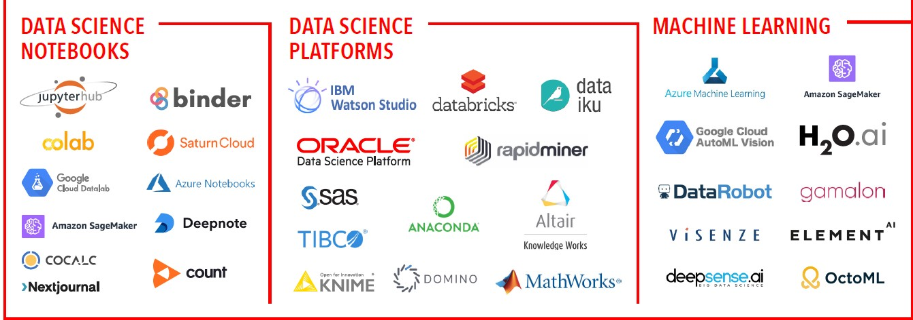

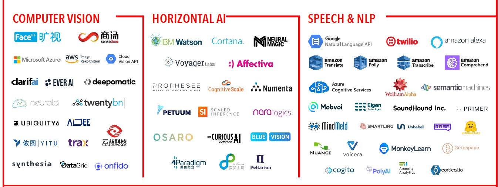

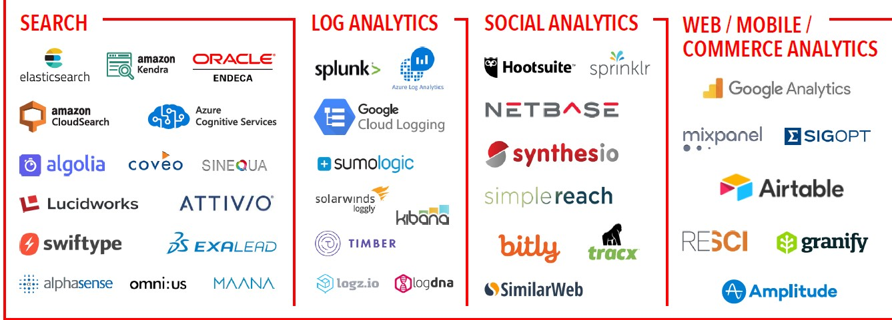

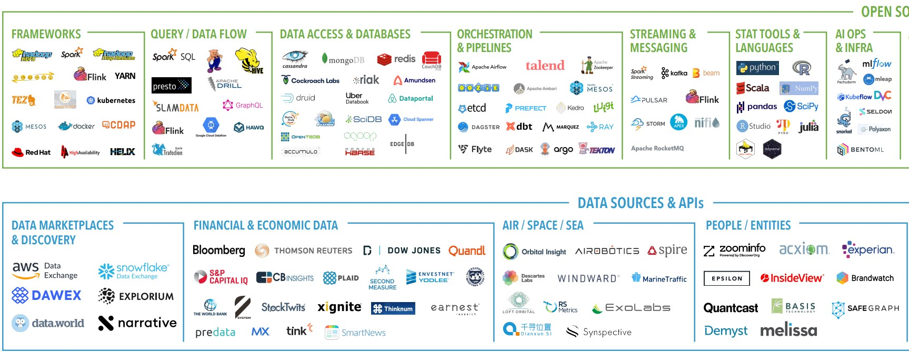

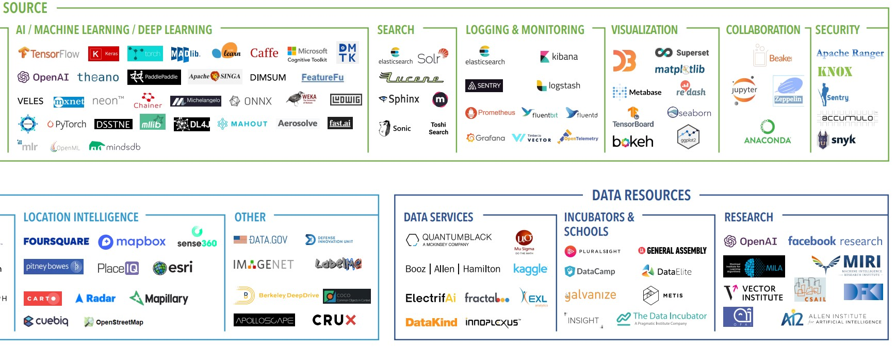

# Chapter 5. data Generation is source systems

## files and unstructured Data

a file is sequence of bytes, typically stored on a disk

you will use certain formats heavily as a data engineer such as Parquet,ORC, and Avro

## APIs

automating API data ingestion

## Application Database(OLTP systems)

online transaction processing system

### ACID

atomicity: all changes to data are performed as if they are a single operation.

consistency means that any databases read will return the last written version of the retrieved item.

Isolation entails that if two updates are in flight concurrently for the same thing, the end database state  will be consistent with the sequential execution of these updates in the order they were submitted.

durability indicates that committed data will never be lost, even in the event of power loss.

atomicity, consistency, isolation, and durability

## online analytical processing system

## change data capture

## logs

1. binary-encoded logs
2. semistructured logs
3. plain-text (unstructured) logs

## Database Logs

## CRUD

## Insert-Only

## messages and streams

## types of times
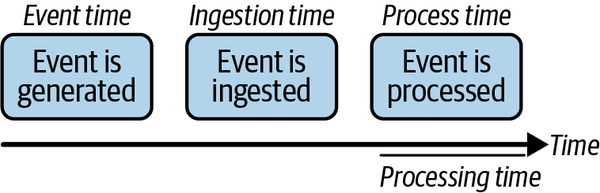

## Apis

### REST api

rest stands for representational state transfer.

one of the principle ideas of REST is that interactions are stateless.each rest call is independent.

### GraphQL

### Webhooks 

simple event-based data-transmission pattern. the data source can be an application backend, web page, mobile app. webhooks are often called reverse APIs

### RPC and gROC

a remote procedure call (RPC) is commonly used in distributed computing.

### data sharing

The core concept of cloud data sharing is that a multitenant system supports security policies for sharing data among tenants. Concretely, any public cloud object storage system with a fine-grained permission system can be a platform for data sharing. Popular cloud data-warehouse platforms also support data-sharing capabilities. Of course, data can also be shared through download or exchange over email, but a multitenant system makes the process much easier.

### Third-Party Data Sources

The consumerization of technology means every company is essentially now a technology company. The consequence is that these companies—and increasingly government agencies—want to make their data available to their customers and users, either as part of their service or as a separate subscription. For example, the US Bureau of Labor Statistics publishes various statistics about the US labor market. The National Aeronautics and Space Administration (NASA) publishes various data from its research initiatives. Facebook shares data with businesses that advertise on its platform.

Why would companies want to make their data available? Data is sticky, and a flywheel is created by allowing users to integrate and extend their application into a user’s application. Greater user adoption and usage means more data, which means users can integrate more data into their applications and data systems. The side effect is there are now almost infinite sources of third-party data.

### message queues and event-streaming platforms

### undercurrents and their impact on source systems

1. security
Is the source system architected so data is secure and encrypted, both with data at rest and while data is transmitted?
Do you have to access the source system over the public internet, or are you using a virtual private network (VPN)?
Do you trust the source system? Always be sure to trust but verify that the source system is legitimate. You don’t want to be on the receiving end of data from a malicious actor.

2. data management

Data governance
Are upstream data and systems governed in a reliable, easy-to-understand fashion? Who manages the data?

Data quality
How do you ensure data quality and integrity in upstream systems? Work with source system teams to set expectations on data and communication.

Schema
Expect that upstream schemas will change. Where possible, collaborate with source system teams to be notified of looming schema changes.

Master data management
Is the creation of upstream records controlled by a master data management practice or system?

Privacy and ethics
Do you have access to raw data, or will the data be obfuscated? What are the implications of the source data? How long is it retained? Does it shift locations based on retention policies?

Regulatory
Based upon regulations, are you supposed to access the data?

3. dataOps

Operational excellence—DevOps, DataOps, MLOps, XOps—should extend up and down the entire stack and support the data engineering and lifecycle. While this is ideal, it’s often not fully realized.

Automation
There’s the automation impacting the source system, such as code updates and new features. Then there’s the DataOps automation that you’ve set up for your data workflows. Does an issue in the source system’s automation impact your data workflow automation? If so, consider decoupling these systems so they can perform automation independently.

Observability
How will you know when there’s an issue with a source system, such as an outage or a data-quality issue? Set up monitoring for source system uptime (or use the monitoring created by the team that owns the source system). Set up checks to ensure that data from the source system conforms with expectations for downstream usage. For example, is the data of good quality? Is the schema conformant? Are customer records consistent? Is data hashed as stipulated by the internal policy?

Incident response
What’s your plan if something bad happens? For example, how will your data pipeline behave if a source system goes offline? What’s your plan to backfill the “lost” data once the source system is back online?

4. data architecture

Reliability
All systems suffer from entropy at some point, and outputs will drift from what’s expected. Bugs are introduced, and random glitches happen. Does the system produce predictable outputs? How often can we expect the system to fail? What’s the mean time to repair to get the system back to sufficient reliability?

Durability
Everything fails. A server might die, a cloud’s zone or region could go offline, or other issues may arise. You need to account for how an inevitable failure or outage will affect your managed data systems. How does the source system handle data loss from hardware failures or network outages? What’s the plan for handling outages for an extended period and limiting the blast radius of an outage?

Availability
What guarantees that the source system is up, running, and available when it’s supposed to be?

People
Who’s in charge of the source system’s design, and how will you know if breaking changes are made in the architecture? A data engineer needs to work with the teams who maintain the source systems and ensure that these systems are architected reliably. Create an SLA with the source system team to set expectations about potential system failure.

5. orchestration

6. software egnineer

# chapter 6. Storage

data engineer storage abstraction

The storage abstraction you require as a data engineer boils down to a few key considerations:

Purpose and use case
You must first identify the purpose of storing the data. What is it used for?

Update patterns
Is the abstraction optimized for bulk updates, streaming inserts, or upserts?

Cost
What are the direct and indirect financial costs? The time to value? The opportunity costs?

Separate storage and compute
The trend is toward separating storage and compute, but most systems hybridize separation and colocation. We cover this in “Separation of Compute from Storage” since it affects purpose, speed, and cost.

Data warehouses are a standard OLAP data architecture

data lake The data lake was originally conceived as a massive store where data was retained in raw, unprocessed form

Data lakes primarily store raw, unprocessed data, often including multimedia files, log files, and other very large files, while data warehouses mostly store structured, processed, and refined data that tends to be text and numbers.

Data Catalog
A data catalog is a centralized metadata store for all data across an organization. Strictly speaking, a data catalog is not a top-level data storage abstraction, but it integrates with various systems and abstractions. Data catalogs typically work across operational and analytics data sources, integrate data lineage and presentation of data relationships, and allow user editing of data descriptions.

Data Sharing

Schema

Example: AWS EMR with S3 and HDFS

Big data services like Amazon EMR spin up temporary HDFS clusters to process data. Engineers have the option of referencing both S3 and HDFS as a filesystem. A common pattern is to stand up HDFS on SSD drives, pull from S3, and save data from intermediate processing steps on local HDFS. Doing so can realize significant performance gains over processing directly from S3. Full results are written back to S3 once the cluster completes its steps, and the cluster and HDFS are deleted. Other consumers read the output data directly from S3.

example : Apache Spark

In practice, Spark generally runs jobs on HDFS or some other ephemeral distributed filesystem to support performant storage of data between processing steps. In addition, Spark relies heavily on in-memory storage of data to improve processing. The problem with owning the infrastructure for running Spark is that dynamic RAM (DRAM) is extremely expensive; by separating compute and storage in the cloud, we can rent large quantities of memory and then release that memory when the job completes.

example: Apache Druid

Apache Druid relies heavily on SSDs to realize high performance. Since SSDs are significantly more expensive than magnetic disks, Druid keeps only one copy of data in its cluster, reducing “live” storage costs by a factor of three.

Of course, maintaining data durability is still critical, so Druid uses an object store as its durability layer. When data is ingested, it’s processed, serialized into compressed columns, and written to cluster SSDs and object storage. In the event of node failure or cluster data corruption, data can be automatically recovered to new nodes. In addition, the cluster can be shut down and then fully recovered from SSD storage.

## data storage lifecycle and data retention

hot,warm,and cold data
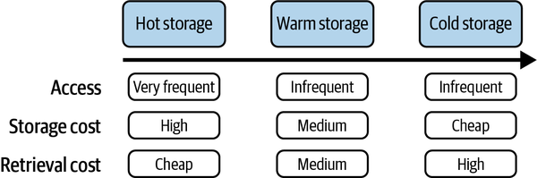

hot data for fast access such as SSD or memory

warm data is accessed semi-regularly, say, once per month. no hard nad fast rules indicate how often warm data is accessed, but it's less than hot data nad more than cold data. for example, S3 offers an infrequently accessed Tier, and Google Cloud has a similar storage tier called Nearline

cold data is infrequently accessed data. the hardware used to archive cold data is typically cheap and durable, such as HDD, tape storage, and cloud-based archival system

## data retention

may cause data swamps, now data engineers need to consider data retention: what data do you need to keep, and how long should you keep it?

## Value

data is an asset

## time

the value to downstream users also depends upon the age of the data. new data is typically more valuable and frequently accessed than older data.

## compliance

certain regulations. such HIPAA, PCI

## cost

data is an asset that has an ROI.

## undercurrents

### security 

as always, exercise the principle of least prilege, don't give full database access to anyone unless required.

### data management

1. data catalogs and metadata management

invest in your metadata. data dictionary, metadata enhance data governance.

2. data versioning in object storage

enable data versioning, it can help with error recovery when processes fail and data becomes corrupted. 
Versioning is beneficial for tracking the history of datasets used to build models.
data version control can aod ML engineer in tacking changes that lead to model performance degradation

3. privacy

GDPR and other privacy regulations have impacted storage system design. data engineer must be prepared to respond to data deletion requests and selectively remove data as required. engineers can accomodata privacy and security through anonymization and masking

4. dataops
dataops concerns itself with traditional operational monitoring of storage systems and monitoring the data itself, inseparable from metadata nad quality

5. system monitoring

data engineer must monitor storage in a variety of ways, this includes monitoring infrastructure storage components, should take the lead on FinOps(cost management), security monitoring, and access monitoring

6. observing and monitoring data

While metadata systems as we’ve described are critical, good engineering must consider the entropic nature of data by actively seeking to understand its characteristics and watching for major changes. Engineers can monitor data statistics, apply anomaly detection methods or simple rules, and actively test and validate for logical inconsistencies.

### data architecture

### Orchestration
storage allows data to flow through pipelines, and orchestration is the pump.

### software engineer

first, the code perform well with storage system. make sure the code you write stores the data correctly and doesn#t accidentally cause data, memory leaks.

second, define your storage infrasttructure as code and use ephemeral compute resources when it's time to process your data.

# Chapter 7. Ingestion

data ingestion is the process of moving data from one place to another. data ingestion implies data movement from source systems into storage in the data enginering lifecycle, with ingestion as an intermediate step

data pipeline is the combination of architecture systems and processes that move data through the stages of the data engineering lifecycle.

1. what's the use case
2. Can I reuse this data and avoid ingesting multiple versions of the same dataset
3. Where is the data going? What’s the destination
4. How often should the data be updated from the source?
5. What is the expected data volume?
6. What format is the data in? Can downstream storage and transformation accept this format?
7. Is the source data in good shape for immediate downstream use? That is, is the data of good quality? What post-processing is required to serve it? What are data-quality risks (e.g., could bot traffic to a website contaminate the data)?
8. Does the data require in-flight processing for downstream ingestion if the data is from a streaming source?

## key consideration for ingestion phase
### Bounded Versus Unbounded Data

all data is unbounded until it's bounded

### frequency

### synchronous vs asynchronous ingestion

### serialization vs deserialization

serialization means encoding the data from a source and preparing data structures for transmission and intermediate storage stages

### throughput and scalability

### reliability vs durability

### payload

### push vs pull vs poll patterns

## Batch ingestion consideration

## Message and steam ingestion considerations

## ways to ingest data

## whom you will work with

## undercurrents

# Chapter 8. Queries, Modeling, And Transformation

# Chapter 9. Serving Data for Analytics, machine learning, and reverse ETL

# security,privacy and The future of data engineering

# Chapter 10. Security and Privacy

# Chapter 11. The Future of Data Engineering

# Appendix A. Serialization and Compression Technical Details

# Appendix B. Cloud Networking

